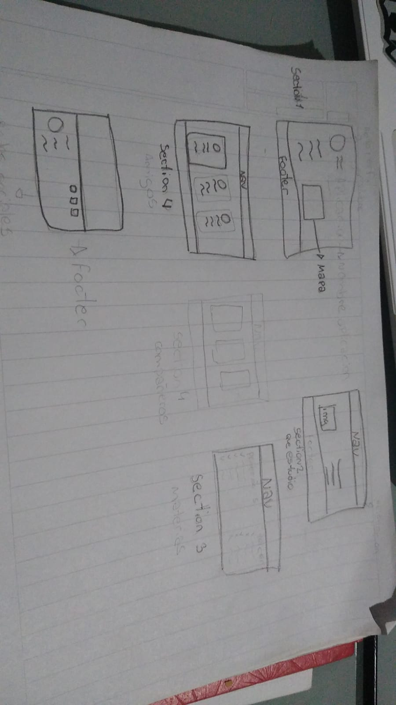

# Trabajo Práctico 1 - Front End

Este es el README para el Trabajo Práctico número 1 de la materia Front End de la Tecnicatura en Desarrollo y Calidad de Software.

## Introducción

En este trabajo práctico, se desarrolló el maquetado inicial de una página web basado en un sketch conceptual realizado en clase. El sketch servía como una guía inicial para el diseño y la estructura de la página web.

## Modificaciones

A lo largo del proceso de maquetado en HTML y CSS, se realizaron modificaciones significativas en comparación con el sketch original. Estas modificaciones fueron necesarias para adaptar el diseño a las mejores prácticas de desarrollo web, la usabilidad y la estética.

## Sketch Principal

A continuación se adjunta una imagen del sketch principal utilizado como referencia inicial para el desarrollo del maquetado:

## Tecnologías Utilizadas

- HTML5
- CSS3

